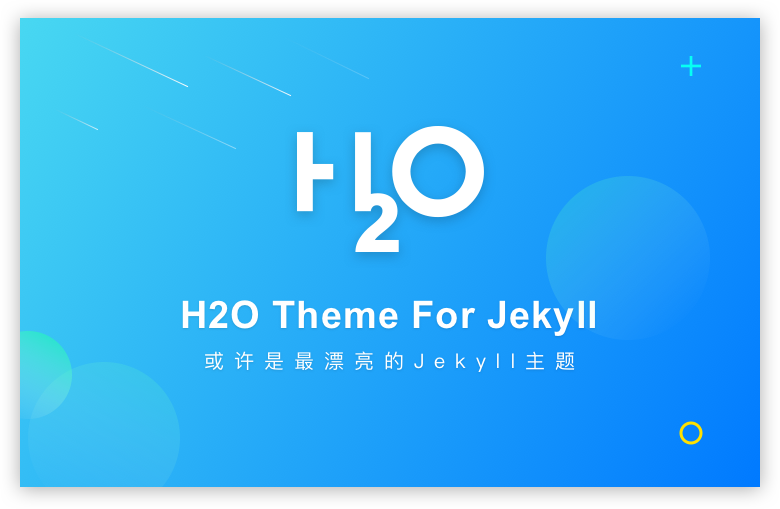

# H2O

A Flat design, responsive Jekyll theme for your blog.

### Live Demo

[My Blog](http://liaokeyu.com/)




### Features

- Theme color: Blue and Pink
- SNS Links
- SEO Title
- Featured Tags
- Hero background patterns
- Fully Responsive for most devices

### Getting Started

#### Install Jekyll

```gem install jekyll bundler```

Install bundle dependiencies:```bundle install```

Then, just ```jekyll server```

You can use jekyll serve --watch to watch for changes in the source files as well.

#### Fork this repository

Hit the Fork button in the top-right corner of the repository to fork a copy of this theme to your GitHub account and rename it to yourusername.github.io and then visit https://yourusername.github.io and you'll be able to see your newly created blog using Jekyll-Mono.

``` git clone https://github.com/kaeyleo/jekyll-theme-H2O.git ```

#### Customise H2O

You can easily get started by modifying _config.yml   
...

### Powered by   
- Jekyll
- jQuery
- [iconfont](http://www.iconfont.cn/)