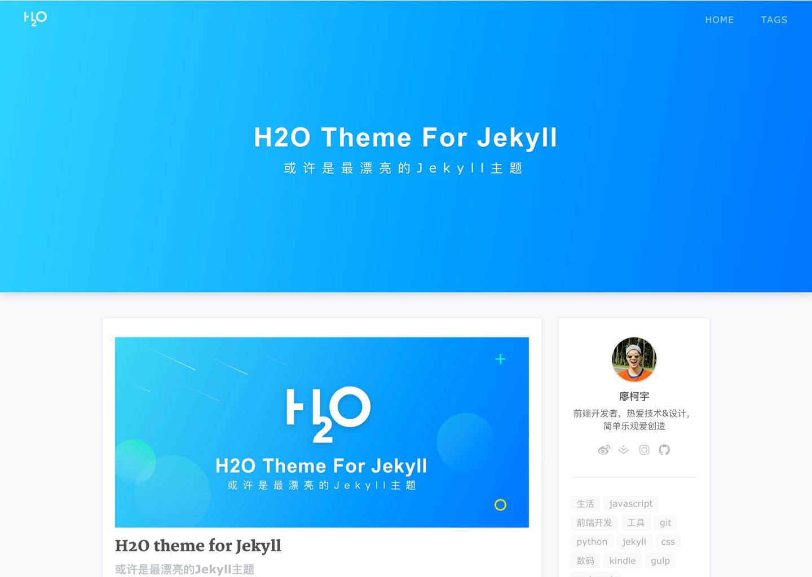
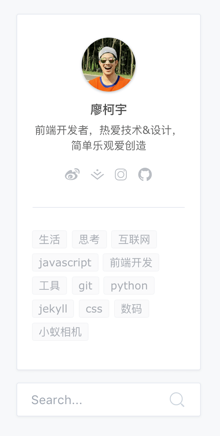
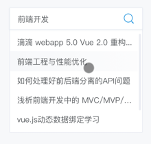
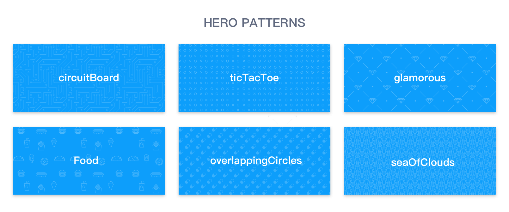

## jekyll-theme-H2O

基于Jekyll的博客主题模板，简洁轻量。

另外，还有此主题的[Ghost版本](https://github.com/eastpiger/ghost-theme-H2O) by [eastpiger](https://github.com/eastpiger)

### Preview

#### [在线预览 Live Demo →](http://liaokeyu.com/)




如果你喜欢这个博客模板，请在右上角star一下，非常感谢～

If you like this theme or using it, please give a ⭐️ for motivation ;)

如果想体验手机浏览效果，可以扫一下二维码：


Using your smartphone to scan the QR Code

### Features 特性

#### CN

- 代码高亮
- 夜间模式
- Disqus评论系统
- 粉蓝两种主题色
- 头图个性化底纹
- 响应式设计
- 社交图标
- SEO标题优化
- 文章标签索引
- 博客文章搜索
- 复制文章内容自动添加版权

#### EN

- Code highlight
- Night mode
- Disqus Comment System
- Theme color: Blue & Pink
- Hero Patterns
- Responsive design
- SNS Icon
- Title SEO
- Tags system
- Search
- Copyright text on copy event

### Usage 快速开始

首先你需要安装Jekyll，请查看文档: [快速指南](http://jekyll.com.cn/docs/quickstart/)

如果你已经安装了Jekyll，请检查版本是否为3.0.x，你可以使用 ```gem update jekyll``` 命令进行升级。

使用 ```gem install jekyll-paginate``` 或 ```sudo gem install jekyll-paginate``` 安装Jekyll的分页插件。

> H2O主题基于Jekyll 3.2.1版本，不同版本之间可能存在部分差异，具体请参考[官方更新文档](https://jekyllrb.com/news/)

点击右上角Fork按钮在你的Github上创建分支，或者```clone```到本地。

``` git clone https://github.com/kaeyleo/jekyll-theme-H2O.git ```

最后，在命令行输入 ```jekyll server``` 开启服务，就能在本地预览主题了。

如果需要部署到线上环境，请参照配置文档的 **开始** 章节进行操作。

### Document 配置文档

#### CN

- 开始
	- [站点信息](#站点信息)
	- [写一篇文章](#写一篇文章)
- 组件
	- [导航](#导航)
	- [侧边栏](#侧边栏)
	- [社交图标](#社交图标)
	- [个人简介](#个人简介)
	- [标签](#标签)
	- [文章搜索](#文章搜索)
	- [代码高亮](#代码高亮)
	- [夜间模式](#夜间模式)
- 个性化
	- [主题皮肤](#主题皮肤)
	- [头图底纹](#头图底纹)
- 高级部分
	- [自定义](#自定义)
- 集成服务
	- [Disqus](#Disqus)
	- [Share.js](#Share.js)

#### EN

- Get Started
	- [Site Settings](#站点信息)
	- [Write Posts](#写一篇文章)
- Components
	- [Navigation Menu](#导航)
	- [Sidebar](#侧边栏)
	- [SNS Icons](#社交图标)
	- [Personal Information](#个人简介)
	- [Tags](#标签)
	- [Search](#文章搜索)
	- [Syntax Highlight](#代码高亮)
	- [Night Mode](#夜间模式)
- Style
	- [Theme Color](#主题皮肤)
	- [Hero Background Patterns](#头图底纹)
- Advanced
	- [Customization](#自定义)
- Plugins
	- [Disqus](#Disqus)
	- [Share.js](#Share.js)


You can easily get started by modifying _config.yml

#### 站点信息

你可以通用修改 `_config.yml` 文件来轻松的开始搭建自己的博客

```
# Site settings
title: '廖柯宇的独立博客' # 你的博客网站标题
description: '很高兴能在这里与你分享我对技术和生活的思考。' # 站点描述
keyword: '廖柯宇, 廖柯宇的独立博客, 前端, 设计' # 网站关键词
url: 'http://liaokeyu.com' # 站点url
baseurl: ''

# Build settings
paginate: 6 # 一页放几篇文章
paginate_path: 'page:num'
```

其实大部分参数已经默认配置好了，你只需要通过文档了解它们，然后根据自己的需求去`_config.yml`文件里修改即可。

#### 写一篇文章

文章一般都放在`_posts`文件夹里，每篇文章的开头都需要设置一些头信息：

```
---
layout: post
title: 'H2O theme for Jekyll'
subtitle: '或许是最漂亮的Jekyll主题'
date: 2017-04-18
categories: 技术
cover: 'http://on2171g4d.bkt.clouddn.com/jekyll-theme-h2o-postcover.jpg'
tags: jekyll 前端开发 设计
---
```

#### 导航

博客顶部的导航栏信息需要以下面的格式进行配置：

```
# Navigation links
nav:
  home: '/'
  tags: '/tags.html'
```

导航链接需要写上完整的html文件名，它们都是放于根目录下的，如果自建文件夹，请务必在`exclude` 参数中增加自建文件夹的文件名:

```
# Build settings
exclude: ['node_modules', 'dev', 'package.json', '自定义的文件夹名字']
```

这样做是为了在Jekyll运行时排除某些文件被复制到运行文件`_site`里去。

#### 侧边栏



侧边栏分为两个部分：【个人简介】和【推荐标签】。当屏幕宽度小于960px时，侧边栏会被隐藏。

#### 社交图标

使用阿里的图标管理平台Iconfont整理了一套常用的社交图标用于博客的个人简介上，包括微博、知乎、掘金、简书、Github等十三个网站，并且对鼠标悬停时的样式颜色进行了优化。

配置格式如下：

```
# SNS settings 配置社交网站url
sns:
  weibo: '//weibo.com/lovecolcol'
  juejin: '//juejin.im/user/57a6f434165abd006159b4cc'
  instagram: '//www.instagram.com/steveliaocn'
  github: '//github.com/kaeyleo'
```

sns属性可选参数：

社交网站 | 参数
--------|----
微博 | `weibo`
知乎 | `zhihu`
推特 | `twitter`
Instagram | `instagram`
掘金 | `juejin`
Github | `github`
豆瓣 | `douban`
Facebook | `facebook`
Dribble | `dribble`
UI中国 | `uicn`
简书 | `jianshu`
Medium | `medium`
领英 | `linkedin`

#### 个人简介

首页侧边栏和文章页面底部都会显示你的个人简介

```
# Author 配置博主信息
author: 'Jack'
nickname: 'xx'
bio: '程序员'
avatar: 'assets/img/avatar.jpg'
```

#### 标签

对侧边栏的标签模块进行相应配置：

```
# Tags
recommend-tags: true
recommend-condition-size: 12

```

Tags配置说明：

 属性 | 参数 | 描述
-----|-----|-------
`recommend-tags` | `true`, `false` | 是否显示推荐标签
`recommend-condition-size` | `12` 或其他数字 | 推荐标签个数限制

#### 文章搜索



基于Jekyll服务器生成文章索引文件 `search.json` 为博客提供搜索服务。输入文章标题或与文章标签相关的关键字即可。

搜索功能默认是开启的，以卡片的样式显示在侧边栏底部。如需关闭请将配置文件 `_config.yml` 中 `search ` 属性的值改为 `false` 。

```
# Search
search: true
```

说明 | 参数
----|-----
开启搜索功能 | `true`
关闭搜索功能 | `false`

#### 代码高亮

模板引入了[Prism.js](http://prismjs.com)，一款轻量、可扩展的代码语法高亮库。

很多知名网站如[MDN](https://developer.mozilla.org/)、[css-tricks](https://css-tricks.com/)也在用它，就连 JavaScript 之父 [Brendan Eich](https://brendaneich.com/) 也在个人博客上使用。


遵循 [HTML5](https://www.w3.org/TR/html5/grouping-content.html#the-pre-element) 标准，Prism 使用语义化的 `<pre>` 元素和 `<code>` 元素来标记代码区块：

```
<pre><code class="language-css">p { color: red }</code></pre>
```

在Markdown中你可以这样写：


	 ```css
		p { color: red }
	 ```

支持语言：

- HTML
- CSS
- Sass
- JavaScript
- CoffeeScript
- Java
- C-like
- Swift
- PHP
- Go
- Python

#### 夜间模式

晚11点至次日凌晨6点自动开启夜间模式。如果不需要，则将配置文件 `_config.yml` 中 `nightMode ` 属性的值改为 `false` 即可。

```
# Night mode
nightMode: true
```

说明 | 参数
----|-----
开启夜间模式 | `true`
关闭夜间模式 | `false`

#### 主题皮肤


支持两种主题颜色蓝色（默认）和粉色

主要效果体现在首页博客封面、顶部导航栏的logo以及鼠标悬停时文字显示的颜色效果。

```
# theme color
theme-color: 'default' # pink or default
```

颜色 | 参数
----|-----
蓝色 | `default`
粉色 | `pink`

如果你希望在博客封面显示图片，需要去index.html文件中的头信息中添加 `header-img` 配置：

```
---
layout: default
home-title: Steven的博客
description: 开发者，创造者
header-img: assets/img/banner.jpg
---
```

#### 头图底纹



在没有图片的情况下单纯显示颜色会不会太无趣了点？于是想到了加入底纹元素，底纹素材是SVG格式的（保存在css样式里），加载比图片快很多。六种底纹（电路、食物、云海、钻石等等）供你选择，配置如下：

```
# Hero background patterns
postPatterns: 'circuitBoard'
```

`postPatterns` 属性参数配置：

底纹描述  |  参数
------|------
电路 | `circuitBoard`
圆环 | `overlappingCircles`
吃货日常：啃打鸡 | `food`
土豪必备：钻石| `glamorous`
圈圈叉叉 | `ticTacToe`
中国风：云海 | `seaOfClouds`

#### 自定义

主题开发使用的技术栈也比较简单：引入jQuery类库、使用Sass代替CSS编写样式，使用Gulp完成Sass的编译、CSS和JavaScript的代码合并压缩等任务。

如果你喜欢折腾，想对模板的代码进行修改，需要使用命令 `npm install` 安装 `package.json` 中的依赖，然后 `gulp` 一下即可开始你的自定义之旅。

在了解H2O主题的目录结构之前，确保你对[Jekyll目录结构](http://jekyll.com.cn/docs/structure/)有所了解。

```		
	.
	├── _config.yml # 配置文件
	├── _includes # 页面组件方便重用
	|   ├── footer.html # 页脚
	|   └── head.html # html文档的头部内容
	|   └── header.html # 顶部菜单栏
	|   └── pageNav.html # 文章列表分页组件
	├── _layouts # 布局模板
	|   ├── default.html # 默认模板
	|   └── post.html # 文章页面模板
	├── _posts # 这里放文章
	|   ├── 2017-05-03-elements-of-javascript-style.md # 命名格式：年-月-日-文章标题.md
	|   └── 2007-02-21-life-on-mars.md
	├── _site # Jekyll将源码处理后生成的站点文件，里面的内容可直接发布
	├── assets # 存放用于线上环境的静态资源，如需修改css和js文件请到dev文件夹
	|   ├── css # dev文件夹中sass编译后的样式文件
	|   └── fonts # 字体文件
	|   └── icons # 图标文件
	|   └── img #  图片文件
	|   └── js # dev文件夹中处理后的脚本文件
	├── dev # 开发文件
	|   ├── js # 存放脚本源码
	|   └── sass # 样式源码
	|       └── app.scss # 整合下面的所有样式文件
	|       └── base.scss # 引入字体、Reset部分样式
	|       └── common.scss # 模板的主要样式
	|       └── helper.scss # 工具样式
	|       └── layouts.scss # 响应式布局
	└── gulpfile.js # 自动化任务脚本
	└── index.html # 模板首页
	└── tags.html # 标签页面
	└── 404.html # 404页面
	└── package.json # 管理项目的依赖项
```

值得注意的是，css及js的源码都在 `dev` 文件夹中，每一次保存 gulp 都会对它们进行处理并保存到 `assets` 文件夹以供 `_site` 上线环境使用。

#### Disqus

[Disqus](https://disqus.com/)是一个第三方社交评论插件，体验相当不错。

模板默认开启Disqus评论插件，如需关闭请在 `_config.yml` 中配置参数 `true` (开启) 或者 `false` (关闭) :  

在配置文件 `_config.yml` 中找到Disqus的相关配置，设置 `disqus` 参数为 `true` 打开评论功能，并且设置 `disqus_url`。

```
# Comments
disqus: true
disqus_url: 'https://你的disqus账户名.disqus.com/embed.js'
```

注：`disqus` 默认值为 `false`

#### Share.js

为了让文章更方便地分享，使用了第三方分享插件[Share.js](http://overtrue.me/share.js/)，支持一键分享到微博、QQ空间、QQ好友、微信、腾讯微博、豆瓣、Facebook、Twitter、Linkedin、Google+、点点等社交网站。

```
# Share
social-share: true # 开启或者关闭分享功能
social-share-items: ['wechat', 'weibo', 'douban','twitter']
```

### Contribution 贡献

Any types of contribution are welcome. Thanks.

接受各种形式的贡献，包括不限于提交问题与需求，修复代码。等待您的 ```Pull Request```

#### 感谢参与代码贡献的伙伴

- [Ray-Eldath](https://github.com/Ray-Eldath)
- [sctop](https://github.com/sctop)
- [bananaappletw](https://github.com/bananaappletw)
- [moycat](https://github.com/moycat)

### License 许可证

Jekyll-Theme-H2O is licensed under [MIT](https://github.com/kaeyleo/jekyll-theme-H2O/blob/master/LICENSE).
