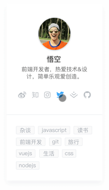
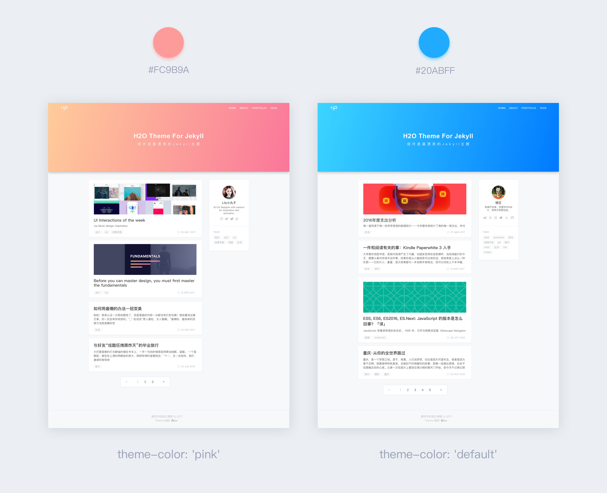

# H2O

[View Live Demo | 在线预览 →](http://liaokeyu.com/)


If you like this theme or using it, please give a ⭐️ for motivation ;)

如果你喜欢这个博客模板，请在右上角star一下，非常感谢～

如果想体验手机浏览效果，可以扫一下二维码：


### Features 特性

- Theme color | 粉蓝两种主题色
- Social icons | 社交图标
- Hero background patterns | 头图个性化底纹
- Sidebar | 侧边栏
- SEO Title | SEO标题优化
- Featured Tags | 文章标签索引
- Fully Responsive for most devices | 响应式设计
- Disqus | 支持Disqus评论系统

### Quick start 快速开始

首先你需要安装Jekyll，请查看文档: [快速指南](http://jekyll.com.cn/docs/quickstart/)

如果你已经安装了Jekyll，请检查版本是否为3.0.x，你可以使用 ```gem update jekyll``` 命令进行升级。

点击右上角Fork按钮在你的Github上创建分支，或者```clone```到本地。

``` git clone https://github.com/kaeyleo/jekyll-theme-H2O.git ```

最后，在命令行输入 ```jekyll server``` 开启服务，就能在本地预览主题了。

### Docs 配置文档

- 开始
	- [站点信息](#site)
	- [写一篇文章](#write-posts)
- 组件
	- [导航](#nav)
	- [侧边栏](#sidebar)
	- [社交图标](#sns)
	- [个人简介](#aboutme)
	- [标签](#tags)
- 个性化
	- [主题色](#theme-color)
	- [头图背景底纹](#bg-patterns)
- 集成服务 
	- [Disqus](#disqus) [Todo]

You can easily get started by modifying _config.yml

#### <span id="site">站点信息</span>

你可以通用修改 `_config.yml` 文件来轻松的开始搭建自己的博客

```
# Site settings
title: '廖柯宇的独立博客' # 你的博客网站标题
description: '很高兴能在这里与你分享我对技术和生活的思考。' # 站点描述
keyword: '廖柯宇, 廖柯宇的独立博客, 前端, 设计' # 网站关键词
url: 'http://liaokeyu.com' # 站点url 
baseurl: '/'
 
# Build settings 
paginate: 6 # 一页放几篇文章
paginate_path: 'page:num'
```
其实大部分参数已经默认配置好了，你只需要通过文档了解它们，然后根据自己的需求去`_config.yml`文件里修改即可。

#### <span id="write-posts">写一篇文章</span>

文章一般都放在`_posts`文件夹里，每篇文章的开头都需要设置一些头信息：

```
---
layout: post
title: 'H2O theme for Jekyll'
subtitle: '或许是最漂亮的Jekyll主题'
date: 2017-04-18
categories: 技术
cover: 'http://on2171g4d.bkt.clouddn.com/jekyll-theme-h2o-postcover.jpg'
tags: jekyll 前端开发 设计
---
```

#### <span id="nav">导航</span>
博客顶部的导航栏信息需要以下面的格式进行配置：

```
# Navigation links
nav:
  home: '/'
  tags: '/tags'
```

导航链接只用写html文件名，它们都是放于根目录下的，如果您自建文件夹，请务必在`exclude` 参数中增加自建文件夹的文件名:

```
# Build settings
exclude: ['node_modules', 'dev', 'package.json', '自定义的文件夹名字']
```

#### <span id="sidebar">侧边栏</span>



侧边栏分为两个部分：【个人简介】和【推荐标签】。当屏幕宽度小于960px时，侧边栏会被隐藏。 

#### <span id="sns">社交图标</span>

使用阿里的图标管理平台Iconfont整理了一套常用的社交图标用于博客的个人简介上，包括微博、知乎、掘金、简书、Github等十二个网站，并且对鼠标悬停时的样式颜色进行了优化。

配置格式如下：

```
# SNS settings 配置社交网站url
sns:
  weibo: '//weibo.com/lovecolcol'
  juejin: '//juejin.im/user/57a6f434165abd006159b4cc'
  instagram: '//www.instagram.com/steveliaocn'
  github: '//github.com/kaeyleo'
```

sns属性可选参数：

社交网站 | 参数
--------|----
微博 | `weibo`
知乎 | `zhihu`
推特 | `twitter`
Instagrame | `instagrame`
掘金 | `juejin`
Github | `github`
Facebook | `facebook`
Dribble | `dribble`
UI中国 | `uicn`
简书 | `jianshu`
Medium | `medium`
领英 | `linkedin`

#### <span id="aboutme">个人简介</span>

首页侧边栏和文章页面底部都会显示你的个人简介

```
# Author 配置博主信息
author: 'Jack'
nickname: 'xx'
bio: '程序员'
avatar: 'assets/img/avatar.jpg'
```

#### <span id="tags">标签</span>

对侧边栏的标签模块进行相应配置：

```
# Tags
recommend-tags: true 
recommend-condition-size: 12
```
Tags配置说明：

         属性      |      参数      |       描述
 -----------------|-----------------|--------------
 `recommend-tags` | `true`, `false` | 是否显示推荐标签
 `recommend-condition-size` | `12` 或其他数字 | 推荐标签个数限制

#### <span id="theme-color">主题色</span>



支持两种主题颜色蓝色（默认）和粉色

主要效果体现在首页博客封面、顶部导航栏的logo以及鼠标悬停时文字显示的颜色效果。

```
# theme color
theme-color: 'default' # pink or default
```

颜色 | 参数
----|-----
蓝色 | `default`
粉色 | `pink`

如果你希望在博客封面显示图片，需要去index.html文件中的头信息中添加 `header-img` 配置：

```
---
layout: default
home-title: Steven的博客
description: 开发者，创造者
header-img: assets/img/banner.jpg
---
```

#### <span id="bg-patterns">头图背景底纹</span>


在没有图片的情况下单纯显示颜色会不会太无趣了点？于是想到了加入底纹元素，底纹素材是SVG格式的（保存在css样式里），加载比图片快很多。六种底纹（电路、食物、云海、钻石等等）供你选择，配置如下：

```
# Hero background patterns
postPatterns: 'circuitBoard'
```

`postPatterns` 属性参数配置：

底纹描述  |  参数
------|------
电路 | `circuitBoard`
圆环 | `overlappingCircles`
吃货日常：啃打鸡 | `food`
土豪必备：钻石| `glamorous`
圈圈叉叉 | `ticTacToe`
中国风：云海 | `seaOfClouds` 

#### <span id="disqus">Disqus</span>

待完成...

### Contributing 贡献

Any types of contribution are welcome. Thanks.

接受各种形式的贡献，包括不限于提交问题与需求，修复代码。等待您的 ```Pull Request```

### License 许可证

Jekyll-Theme-H2O is licensed under [MIT](https://github.com/kaeyleo/jekyll-theme-H2O/blob/master/LICENSE).